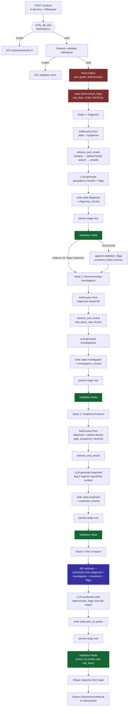

```mermaid
flowchart TD
    A["POST /analyze<br/>X-Api-Key + AiRequest"] --> B{{"verify_api_key<br/>dependency"}}
    B -->|invalid| B1["401 AuthenticationError"]
    B -->|valid| C["Pydantic validates AiRequest"]
    C -->|invalid| C1["422 validation error"]
    C -->|valid| D["Rule Engine<br/>(pre-graph, deterministic)"]

    D --> E["state.deterministic_flags<br/>risk_floor: LOW..CRITICAL"]

    E --> F["Node 1: Diagnosis"]
    F --> F1["build query from<br/>vitals + symptoms"]
    F1 --> F2["retrieve_and_rerank<br/>(embed → Qdrant hybrid search → rerank)"]
    F2 --> F3["LLM generate<br/>grounded in chunks + flags"]
    F3 --> F4["write state.diagnosis<br/>+ diagnosis_chunks"]
    F4 --> F5["persist stage row"]

    F5 --> V1["Validation Node"]
    V1 -->|citations ok, flags respected| G["Node 2: Recommended Investigation"]
    V1 -->|issue found| V1F["append validation_flags<br/>(continue unless severe)"]
    V1F --> G

    G --> G1["build query from<br/>diagnosis keywords"]
    G1 --> G2["retrieve_and_rerank<br/>new query, new chunks"]
    G2 --> G3["LLM generate investigations"]
    G3 --> G4["write state.investigation<br/>+ investigation_chunks"]
    G4 --> G5["persist stage row"]

    G5 --> V2["Validation Node"]
    V2 --> H["Node 3: Treatment Protocol"]

    H --> H1["build query from<br/>diagnosis + patient factors<br/>(age, pregnancy, severity)"]
    H1 --> H2["retrieve_and_rerank"]
    H2 --> H3["LLM generate treatment<br/>flag if regimen specificity unclear"]
    H3 --> H4["write state.treatment<br/>+ treatment_chunks"]
    H4 --> H5["persist stage row"]

    H5 --> V3["Validation Node"]
    V3 --> I["Node 4: Plan of Action"]

    I --> I1["NO retrieval —<br/>synthesize from diagnosis +<br/>investigation + treatment + flags"]
    I1 --> I2["LLM synthesize plan<br/>deterministic_flags override output"]
    I2 --> I3["write state.plan_of_action"]
    I3 --> I4["persist stage row"]

    I4 --> V4["Validation Node<br/>(check no conflict with risk_floor)"]
    V4 --> J["Shape response from state"]
    J --> K["Return AiAssessmentResult<br/>to Spring Boot"]

    style D fill:#7c2d2d,stroke:#f87171,color:#fff
    style E fill:#7c2d2d,stroke:#f87171,color:#fff
    style I1 fill:#3730a3,stroke:#818cf8,color:#fff
    style V1 fill:#166534,stroke:#4ade80,color:#fff
    style V2 fill:#166534,stroke:#4ade80,color:#fff
    style V3 fill:#166534,stroke:#4ade80,color:#fff
    style V4 fill:#166534,stroke:#4ade80,color:#fff
```